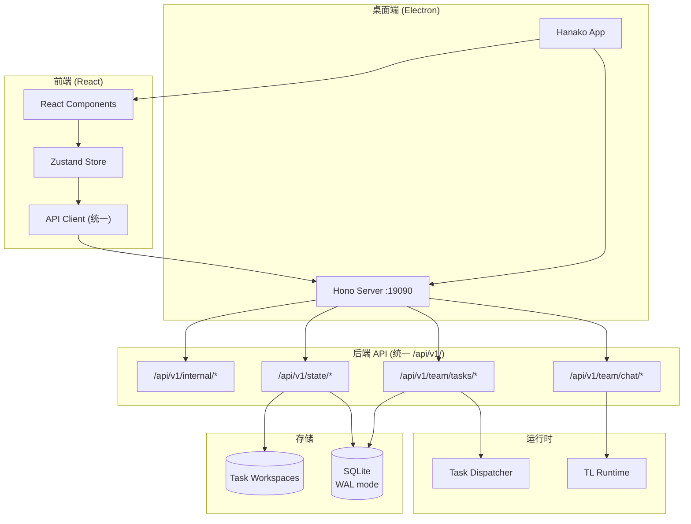

# AI Team 重构优化文档

## 1. 重构概述

本次重构参考 OpenHanako 架构，对 AI Team Runtime 进行全面优化：

### 1.1 主要变更

| 变更项 | 旧方案 | 新方案 |
|-------|-------|-------|
| HTTP 框架 | Node.js 原生 http | **Hono** |
| API 路径 | `/api/`, `/state/team/`, `/internal/team/` | **统一 `/api/v1/`** |
| 命名规范 | snake_case 与 camelCase 混用 | **统一 camelCase** |
| 桌面集成 | 独立 Electron | **Electron + 集成 Hono Server** |
| 构建输出 | 无 | **exe/dmg 安装包** |

### 1.2 架构图



## 2. API 统一方案

### 2.1 统一路径前缀

所有 API 统一使用 `/api/v1/` 前缀：

| 类别 | 旧路径 | 新路径 |
|-----|-------|-------|
| Chat | `/api/chat/create` | `/api/v1/team/chat` |
| Chat | `/api/chat/task` | `/api/v1/team/chat/task` |
| Task Control | `/api/dashboard/control` | `/api/v1/team/tasks/:taskId/control` |
| Task Files | `/api/task/:taskId/files` | `/api/v1/team/tasks/:taskId/files` |
| State | `/state/team/summary` | `/api/v1/state/team/summary` |
| State | `/state/team/workbench` | `/api/v1/state/team/workbench` |
| Config | `/api/config/roles` | `/api/v1/team/config/roles` |
| Internal | `/internal/team/task` | `/api/v1/internal/team/task` |
| Internal | `/internal/team/dispatch` | `/api/v1/internal/team/dispatch` |

### 2.2 响应格式统一

所有响应使用统一的 Envelope 格式：

```json
{
  "ok": true,
  "route": "state/team/summary",
  "resourceKind": "task_summary",
  "query": { "taskId": "xxx" },
  "payload": { ... },
  "timestamp": 1713250000000
}
```

### 2.3 命名规范

- 请求参数：camelCase
- 响应字段：camelCase
- 路由路径：kebab-case

## 3. Hono 框架集成

### 3.1 新增文件

```
apps/api-server/src/
├── index-hono.mjs          # Hono 入口
├── middleware/
│   ├── auth.mjs           # 认证中间件
│   └── response.mjs       # 响应格式化中间件
└── routes/
    └── v1/
        ├── team-routes.mjs    # /api/v1/team/* 路由
        ├── state-routes.mjs   # /api/v1/state/* 路由
        └── internal-routes.mjs # /api/v1/internal/* 路由
```

### 3.2 中间件

- **CORS**: 自动处理跨域
- **Auth**: 统一认证检查
- **Response**: 统一的响应格式化

## 4. Electron 桌面端

### 4.1 架构变更

- Electron 启动时自动启动集成的 Hono Server
- API Server 通过 `http://127.0.0.1:19090` 访问
- 支持 exe/dmg 安装包构建

### 4.2 构建命令

```bash
# 开发模式
npm run electron:dev

# 构建 Electron 应用
npm run electron:build

# 打包安装包
npm run electron:package
```

### 4.3 Windows exe 构建配置

```json
{
  "win": {
    "target": [{ "target": "nsis", "arch": ["x64"] }]
  },
  "nsis": {
    "oneClick": false,
    "perMachine": false,
    "allowToChangeInstallationDirectory": true,
    "createDesktopShortcut": true,
    "createStartMenuShortcut": true
  }
}
```

## 5. 配置统一管理

### 5.1 环境变量

| 变量 | 说明 | 默认值 |
|-----|------|-------|
| `API_SERVER_PORT` | API Server 端口 | 19090 |
| `API_SERVER_URL` | API 基础 URL | http://127.0.0.1:19090 |
| `DASHBOARD_CORS_ORIGIN` | CORS 允许的源 | * |
| `DASHBOARD_TOKEN` | Dashboard 认证 Token | - |

### 5.2 前端配置

```bash
NEXT_PUBLIC_API_BASE=http://127.0.0.1:19090
NEXT_PUBLIC_API_V1_BASE=http://127.0.0.1:19090/api/v1
NEXT_PUBLIC_WS_URL=ws://127.0.0.1:19090/ws/chat
```

## 6. 迁移指南

### 6.1 从旧 API 迁移

前端代码中的 API 调用会自动映射到新路径：

```typescript
// 旧代码 (自动兼容)
fetch('/state/team/summary?taskId=xxx')

// 新代码 (推荐)
fetch('/api/v1/state/team/summary?taskId=xxx')
```

### 6.2 启动 Hono Server

```bash
# 启动新的 Hono Server
cd apps/api-server
npm run start:hono

# 或使用原有的 HTTP Server
npm run start
```

## 7. 后续优化计划

1. [ ] 添加更多 API 端点的 v1 版本
2. [ ] 优化 WebSocket 在 Hono 中的处理
3. [ ] 添加 API 版本协商机制
4. [ ] 完善 Electron 安装程序的图标和签名
5. [ ] 添加自动更新功能
